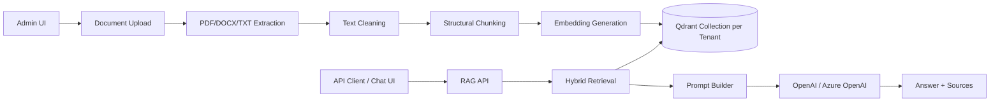

# SK UserGuide RAG Architecture

Tenant-aware Retrieval-Augmented Generation (RAG) application built with ASP.NET Core MVC, Semantic Kernel, OpenAI/Azure OpenAI, and Qdrant.

The project provides:

- A multi-tenant Admin UI for creating tenant collections and uploading documents.
- A tenant-aware Chat UI for asking questions against a selected tenant collection.
- Public RAG API endpoints for external clients.
- Document ingestion for PDF, DOCX, and TXT files.
- Hybrid retrieval using vector search and keyword search.

## Architecture



## Key Features

### Multi-Tenant RAG

Each tenant is represented as a separate Qdrant collection.

Examples:

- `Migros-HR`
- `Migros-Campaign_Policies`
- `CocaCola-ConnectedPlanning`

The API and Chat UI require `tenantId`. The system does not silently fall back to a default collection.

### Admin UI

The Admin panel supports:

- Listing existing Qdrant tenant collections.
- Creating a new tenant collection.
- Uploading documents into the selected tenant collection.
- Listing documents for the selected tenant.
- Deleting documents from the selected tenant.

### Chat UI

The Chat page supports:

- Selecting an active tenant.
- Sending questions only when a tenant is selected.
- Streaming answers from the backend.
- Hiding sources when the model states that the provided documents do not contain enough information.

### RAG API

The API requires `tenantId` in the request body.

If `tenantId` is missing, the API returns `400 Bad Request`.

If the tenant collection does not exist, the API returns `404 Not Found`.

### Ingestion Pipeline

Supported files:

- `.pdf`
- `.docx`
- `.txt`

Pipeline:

1. Extract text.
2. Clean and normalize text.
3. Repair common mojibake/encoding issues.
4. Chunk structurally by headings, paragraphs, lists, and tables.
5. Generate embeddings.
6. Store vectors and metadata in Qdrant.

### Chunking Improvements

The chunking process includes:

- Token-aware chunking using `cl100k_base`.
- Section-aware heading boundaries.
- Numbered heading hierarchy support, such as `1`, `1.2`, and `1.2.3`.
- Step/list preservation.
- Table-aware chunking.
- Overlap for long text.
- Chunk quality logging.
- Turkish language metadata detection.
- Normalized text payload for better Turkish sparse search.

## Tech Stack

- ASP.NET Core MVC
- .NET 9
- Microsoft Semantic Kernel
- OpenAI or Azure OpenAI
- Qdrant
- iText 7 for PDF extraction
- OpenXML SDK for DOCX extraction
- Bootstrap for UI

## Project Structure

```text
RAG_Architecture/
├── SK-UserGuide.sln
├── docker-compose.yml
├── Dockerfile
├── README.md
├── PROJECT_CONTEXT.md
└── SK-UserGuide/
    ├── Controllers/
    ├── Services/
    │   ├── Abstract/
    │   ├── Concrete/
    │   ├── Ingestion/
    │   ├── LLM/
    │   └── Retrieval/
    ├── Configuration/
    ├── Models/
    ├── Views/
    └── wwwroot/
```

## Prerequisites

- .NET 9 SDK
- Docker
- OpenAI API key or Azure OpenAI deployment

## Running Qdrant

Start Qdrant with Docker Compose:

```powershell
docker compose up -d
```

Qdrant runs on:

```text
http://localhost:6333
```

## Configuration

Configuration is in:

```text
SK-UserGuide/appsettings.json
```

Example:

```json
{
  "Qdrant": {
    "Host": "http://localhost:6333",
    "Port": 6333,
    "DefaultCollection": "default"
  },
  "Llm": {
    "Provider": "OpenAI",
    "EmbeddingDimensions": 1536,
    "MaxTokens": 1500,
    "Temperature": 0.3,
    "TopP": 0.9
  },
  "OpenAI": {
    "ApiKey": "YOUR_API_KEY",
    "ChatModel": "YOUR_CHAT_MODEL",
    "EmbeddingModel": "YOUR_EMBEDDING_MODEL"
  },
  "AzureOpenAI": {
    "Endpoint": "YOUR_ENDPOINT",
    "ApiKey": "YOUR_API_KEY",
    "ChatDeploymentName": "YOUR_CHAT_DEPLOYMENT_NAME",
    "EmbeddingDeploymentName": "YOUR_EMBEDDING_DEPLOYMENT_NAME"
  }
}
```

For local development, prefer user secrets or environment variables instead of committing real API keys.

## Build

```powershell
dotnet build SK-UserGuide.sln --no-restore
```

## Run

```powershell
dotnet run --project SK-UserGuide --urls http://localhost:5257
```

Open:

```text
http://localhost:5257
```

## Usage

### 1. Create a Tenant

Open the Admin page and create a tenant collection, for example:

```text
Migros-HR
```

This creates a Qdrant collection with the same name.

### 2. Upload Documents

Select the tenant in the Admin panel and upload PDF, DOCX, or TXT files.

Documents are chunked, embedded, and stored in the selected tenant collection.

### 3. Ask Questions

Open the Chat page, select a tenant, and ask a question.

The answer is generated only from the selected tenant collection.

## API Examples

### Ask

```http
POST /api/rag/ask
Content-Type: application/json
```

```json
{
  "question": "Calisan izin talebi nasil ilerler?",
  "tenantId": "Migros-HR"
}
```

Response:

```json
{
  "answer": "...",
  "sources": [
    {
      "docName": "Migros-HR.txt",
      "sectionTitle": "9. Izin ve Devamsizlik Sureci",
      "score": 0
    }
  ],
  "fromCache": false
}
```

### Streaming Ask

```http
POST /api/rag/ask/stream
Content-Type: application/json
```

```json
{
  "question": "Calisan izin talebi nasil ilerler?",
  "tenantId": "Migros-HR"
}
```

The endpoint returns Server-Sent Events.

## Error Behavior

Missing tenant:

```json
{
  "error": "TenantId is required."
}
```

Missing tenant collection:

```json
{
  "error": "Tenant collection was not found. Create the tenant and upload documents before asking questions.",
  "tenantId": "unknown-tenant"
}
```

If the selected tenant exists but no relevant indexed content is found, the system returns a friendly message instead of falling back to general chat.

## Important Notes

- Existing Qdrant collections created before the latest ingestion improvements may not include `text_normalized` payloads.
- To benefit from normalized Turkish sparse search and mojibake repair, re-upload existing documents.
- Chat history is not persisted or sent to the backend yet.
- Authentication and tenant authorization are not implemented yet.
- Swagger may be enabled broadly; review this before production deployment.

## Known Build Warnings

Current build can succeed while still showing:

- A known vulnerability warning for `Microsoft.SemanticKernel.Core 1.68.0`.
- `CA2022` warning in `TxtTextExtractor.cs`.

These should be addressed before production use.

## Suggested Next Steps

- Add authentication and tenant-level authorization.
- Add persistent conversation history if required.
- Add automated tests for ingestion, tenant routing, and retrieval.
- Upgrade vulnerable NuGet packages.
- Add deployment-specific configuration for production.

